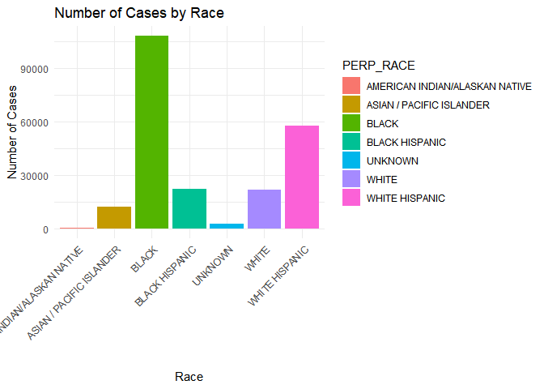

# PROJECT ANALYSIS ALBERTO
Alberto Attie

``` r
library(tidyverse) 
```

    Warning: package 'tidyverse' was built under R version 4.2.3

    Warning: package 'ggplot2' was built under R version 4.2.3

    Warning: package 'tibble' was built under R version 4.2.3

    Warning: package 'readr' was built under R version 4.2.3

    Warning: package 'purrr' was built under R version 4.2.3

    Warning: package 'dplyr' was built under R version 4.2.3

    Warning: package 'forcats' was built under R version 4.2.3

    Warning: package 'lubridate' was built under R version 4.2.3

    ── Attaching core tidyverse packages ──────────────────────── tidyverse 2.0.0 ──
    ✔ dplyr     1.1.4     ✔ readr     2.1.5
    ✔ forcats   1.0.0     ✔ stringr   1.5.0
    ✔ ggplot2   3.4.4     ✔ tibble    3.2.1
    ✔ lubridate 1.9.3     ✔ tidyr     1.3.0
    ✔ purrr     1.0.2     
    ── Conflicts ────────────────────────────────────────── tidyverse_conflicts() ──
    ✖ dplyr::filter() masks stats::filter()
    ✖ dplyr::lag()    masks stats::lag()
    ℹ Use the conflicted package (<http://conflicted.r-lib.org/>) to force all conflicts to become errors

``` r
library(ggplot2)
```

``` r
ds <- read_csv("dataset/NYPD.csv",show_col_types = FALSE )|>
select(-ARREST_KEY,-PD_CD,-KY_CD,-LAW_CODE,-ARREST_BORO,-JURISDICTION_CODE) 

#saveRDS(ds, "dataset/NYPD.rds")
```

``` r
na_count <- sum(is.na(ds))
na_count
```

    [1] 1599

``` r
# Remove rows with any NA values from the dataset
ds <- na.omit(ds) 

dim(ds)
```

    [1] 225273     13

``` r
dim(ds) 
```

    [1] 225273     13

``` r
ds
```

    # A tibble: 225,273 × 13
       ARREST_DATE PD_DESC   OFNS_DESC LAW_CAT_CD ARREST_PRECINCT AGE_GROUP PERP_SEX
       <chr>       <chr>     <chr>     <chr>                <dbl> <chr>     <chr>   
     1 01/03/2023  ROBBERY,… ROBBERY   F                       49 18-24     M       
     2 01/03/2023  STRANGUL… FELONY A… F                      120 25-44     M       
     3 01/04/2023  ROBBERY,… ROBBERY   F                       61 <18       M       
     4 01/04/2023  STRANGUL… FELONY A… F                      114 18-24     M       
     5 01/05/2023  BURGLARY… BURGLARY  F                       44 25-44     F       
     6 01/08/2023  ASSAULT … FELONY A… F                       76 25-44     M       
     7 01/09/2023  ARSON 2,… ARSON     F                       49 25-44     M       
     8 01/14/2023  ASSAULT … FELONY A… F                       90 25-44     M       
     9 01/14/2023  ARSON 2,… ARSON     F                       63 25-44     M       
    10 02/03/2023  STRANGUL… FELONY A… F                       34 25-44     M       
    # ℹ 225,263 more rows
    # ℹ 6 more variables: PERP_RACE <chr>, X_COORD_CD <dbl>, Y_COORD_CD <dbl>,
    #   Latitude <dbl>, Longitude <dbl>, `New Georeferenced Column` <chr>

``` r
saveRDS(ds, "dataset/NYPD.rds")
```

``` r
unique_count <- unique(ds$OFNS_DESC) # Count unique cases based on the "OFNS_DESC" 
length(unique_count) # there are 64 different types of arrest cases 
```

    [1] 63

``` r
ds|>
ggplot(aes(PERP_RACE)) +
geom_bar(aes(fill = PERP_RACE)) +
theme_minimal() +
labs(x = 'Race', y = 'Number of Cases', title = 'Number of Cases by Race') +
theme(axis.text.x = element_text(angle = 45, hjust = 1))
```


